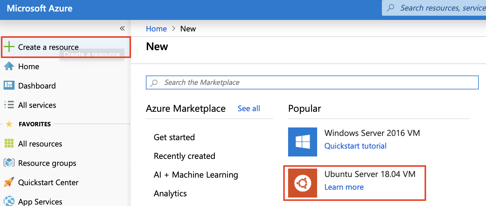
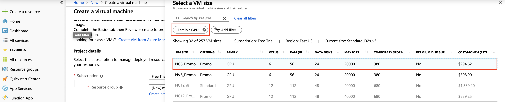
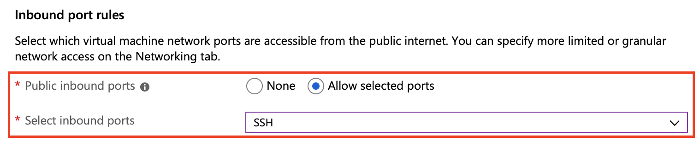
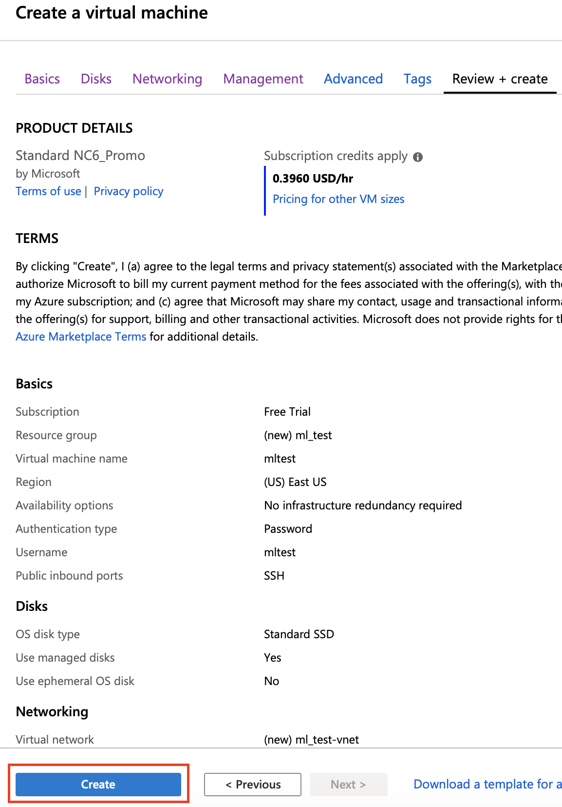

# How to create Azure Virtual Machine to run Machine Learning

## Step 1. Create GPU enabled virtual machine (VM) from Azure portal








## Step 2. Install Nvidia CUDA toolkik on the created VM

```
$ wget https://developer.download.nvidia.com/compute/cuda/repos/ubuntu1804/x86_64/cuda-repo-ubuntu1804_10.1.168-1_amd64.deb
$ sudo apt-key adv --fetch-keys http://developer.download.nvidia.com/compute/cuda/repos/ubuntu1804/x86_64/7fa2af80.pub
$ sudo dpkg -i cuda-repo-ubuntu1804_10.1.168-1_amd64.deb
$ sudo apt-get update
$ sudo apt-get install cuda
```

## Step 3. Install Anaconda 
For this document, we used Anaconda 3 (Anaconda3-2018.12-Linux-x86_64)

```
$ wget https://repo.anaconda.com/archive/Anaconda3-2018.12-Linux-x86_64.sh
$ bash Anaconda3-2018.12-Linux-x86_64.sh
$ export PATH="/home/your_user_name/anaconda3/bin:$PATH"
```

## Step 4. Create Python virtual environment with Tensorflow-GPU and other packages

You can change the list of packages and the version of python as you need but tensorflow-gpu, scikit-learn, and scipy are needed to run the machine learning codes with support of the Tensorflow (GPU).

In this example, we used tensorflow-gpu version 1.13.1 and python version 3.6.

```
conda create -n tfgpu python=3.6 tensorflow-gpu=1.13.1 numpy=1.16.4 pandas matplotlib scikit-learn scipy pillow xlrd nb_conda ipykernel
```

## Step 5. Actiavet the created virtual environment and test if the Tensorflow is available

```
$ conda activate tfgputest
(tfgputest) $ python
Python 3.6.9 |Anaconda, Inc.| (default, Jul 30 2019, 19:07:31) 
[GCC 7.3.0] on linux
Type "help", "copyright", "credits" or "license" for more information.
>>> import tensorflow as tf
>>> tf.__version__
'1.13.1'
>>> 
```

## Appendix A
Entire log from the Step 2 to 5.
```
Welcome to Ubuntu 18.04.3 LTS (GNU/Linux 5.0.0-1018-azure x86_64)

 * Documentation:  https://help.ubuntu.com
 * Management:     https://landscape.canonical.com
 * Support:        https://ubuntu.com/advantage

  System information as of Mon Sep 30 02:16:16 UTC 2019

  System load:  0.52              Processes:           163
  Usage of /:   4.2% of 28.90GB   Users logged in:     0
  Memory usage: 0%                IP address for eth0: 10.0.1.4
  Swap usage:   0%

7 packages can be updated.
7 updates are security updates.


The programs included with the Ubuntu system are free software;
the exact distribution terms for each program are described in the
individual files in /usr/share/doc/*/copyright.

Ubuntu comes with ABSOLUTELY NO WARRANTY, to the extent permitted by
applicable law.

To run a command as administrator (user "root"), use "sudo <command>".
See "man sudo_root" for details.

mltest@mltest:~$ wget https://developer.download.nvidia.com/compute/cuda/repos/ubuntu1804/x86_64/cuda-repo-ubuntu1804_10.1.168-1_amd64.deb
--2019-09-30 02:16:42--  https://developer.download.nvidia.com/compute/cuda/repos/ubuntu1804/x86_64/cuda-repo-ubuntu1804_10.1.168-1_amd64.deb
Resolving developer.download.nvidia.com (developer.download.nvidia.com)... 192.229.211.70, 2606:2800:21f:3aa:dcf:37b:1ed6:1fb
Connecting to developer.download.nvidia.com (developer.download.nvidia.com)|192.229.211.70|:443... connected.
HTTP request sent, awaiting response... 200 OK
Length: 2936 (2.9K) [application/x-deb]
Saving to: ‘cuda-repo-ubuntu1804_10.1.168-1_amd64.deb’

cuda-repo-ubuntu1804_10.1. 100%[======================================>]   2.87K  --.-KB/s    in 0s      

2019-09-30 02:16:42 (151 MB/s) - ‘cuda-repo-ubuntu1804_10.1.168-1_amd64.deb’ saved [2936/2936]

mltest@mltest:~$ sudo apt-key adv --fetch-keys http://developer.download.nvidia.com/compute/cuda/repos/ubuntu1804/x86_64/7fa2af80.pub
Executing: /tmp/apt-key-gpghome.ECHdshb6IC/gpg.1.sh --fetch-keys http://developer.download.nvidia.com/compute/cuda/repos/ubuntu1804/x86_64/7fa2af80.pub
gpg: requesting key from 'http://developer.download.nvidia.com/compute/cuda/repos/ubuntu1804/x86_64/7fa2af80.pub'
gpg: key F60F4B3D7FA2AF80: public key "cudatools <cudatools@nvidia.com>" imported
gpg: Total number processed: 1
gpg:               imported: 1
mltest@mltest:~$ sudo dpkg -i cuda-repo-ubuntu1804_10.1.168-1_amd64.deb
Selecting previously unselected package cuda-repo-ubuntu1804.
(Reading database ... 56293 files and directories currently installed.)
Preparing to unpack cuda-repo-ubuntu1804_10.1.168-1_amd64.deb ...
Unpacking cuda-repo-ubuntu1804 (10.1.168-1) ...
Setting up cuda-repo-ubuntu1804 (10.1.168-1) ...
mltest@mltest:~$ sudo apt-get update
Hit:1 http://azure.archive.ubuntu.com/ubuntu bionic InRelease
Get:2 http://azure.archive.ubuntu.com/ubuntu bionic-updates InRelease [88.7 kB]
Get:3 http://azure.archive.ubuntu.com/ubuntu bionic-backports InRelease [74.6 kB]
Ign:4 http://developer.download.nvidia.com/compute/cuda/repos/ubuntu1804/x86_64  InRelease           
Get:5 http://developer.download.nvidia.com/compute/cuda/repos/ubuntu1804/x86_64  Release [564 B]     
Get:6 http://developer.download.nvidia.com/compute/cuda/repos/ubuntu1804/x86_64  Release.gpg [819 B] ...    
Get:25 http://security.ubuntu.com/ubuntu bionic-security/multiverse Translation-en [2396 B]
Fetched 4239 kB in 3s (1363 kB/s)                      
Reading package lists... Done
mltest@mltest:~$ sudo apt-get install cuda
Reading package lists... Done
Building dependency tree... 50%
Building dependency tree       
Reading state information... Done
The following additional packages will be installed:
  adwaita-icon-theme at-spi2-core binutils binutils-common binutils-x86-64-linux-gnu build-essential
  ca-certificates-java cpp cpp-7 cuda-10-1 cuda-command-line-tools-10-1 cuda-compiler-10-1
  cuda-cudart-10-1 cuda-cudart-dev-10-1 cuda-cufft-10-1 cuda-cufft-dev-10-1 cuda-cuobjdump-10-1
  cuda-cupti-10-1 cuda-curand-10-1 cuda-curand-dev-10-1 cuda-cusolver-10-1 cuda-cusolver-dev-10-1
...
Processing triggers for libc-bin (2.27-3ubuntu1) ...
Processing triggers for dbus (1.12.2-1ubuntu1.1) ...
mltest@mltest:~$ wget https://repo.anaconda.com/archive/Anaconda3-2018.12-Linux-x86_64.sh
--2019-09-30 02:31:43--  https://repo.anaconda.com/archive/Anaconda3-2018.12-Linux-x86_64.sh
Resolving repo.anaconda.com (repo.anaconda.com)... 104.16.130.3, 104.16.131.3, 2606:4700::6810:8303, ...
Connecting to repo.anaconda.com (repo.anaconda.com)|104.16.130.3|:443... connected.
HTTP request sent, awaiting response... 200 OK
Length: 684237703 (653M) [application/x-sh]
Saving to: ‘Anaconda3-2018.12-Linux-x86_64.sh’

Anaconda3-2018.12-Linux-x86_64.sh    100%[=====================================================================>] 652.54M   129MB/s    in 5.4s    

2019-09-30 02:31:49 (120 MB/s) - ‘Anaconda3-2018.12-Linux-x86_64.sh’ saved [684237703/684237703]

mltest@mltest:~$ bash Anaconda3-2018.12-Linux-x86_64.sh

Welcome to Anaconda3 2018.12

In order to continue the installation process, please review the license
agreement.
Please, press ENTER to continue
>>> 
===================================
Anaconda End User License Agreement
===================================

Copyright 2015, Anaconda, Inc.

All rights reserved under the 3-clause BSD License:

...

Do you accept the license terms? [yes|no]
[no] >>> 
Please answer 'yes' or 'no':'
>>> yes

Anaconda3 will now be installed into this location:
/home/mltest/anaconda3

  - Press ENTER to confirm the location
  - Press CTRL-C to abort the installation
  - Or specify a different location below

[/home/mltest/anaconda3] >>> 
PREFIX=/home/mltest/anaconda3


installing: python-3.7.1-h0371630_7 ...
Python 3.7.1
installing: blas-1.0-mkl ...
installing: ca-certificates-2018.03.07-0 ...
installing: conda-env-2.6.0-1 ...
...
installing: conda-build-3.17.6-py37_0 ...
installation finished.
Do you wish the installer to initialize Anaconda3
in your /home/mltest/.bashrc ? [yes|no]
[no] >>> 
You may wish to edit your /home/mltest/.bashrc to setup Anaconda3:

source /home/mltest/anaconda3/etc/profile.d/conda.sh

Thank you for installing Anaconda3!

===========================================================================

Anaconda is partnered with Microsoft! Microsoft VSCode is a streamlined
code editor with support for development operations like debugging, task
running and version control.

To install Visual Studio Code, you will need:
  - Administrator Privileges
  - Internet connectivity

Visual Studio Code License: https://code.visualstudio.com/license

Do you wish to proceed with the installation of Microsoft VSCode? [yes|no]
>>> Please answer 'yes' or 'no':
>>> no
mltest@mltest:~$ export PATH="/home/mltest/anaconda3/bin:$PATH"
mltest@mltest:~$ conda
usage: conda [-h] [-V] command ...

conda is a tool for managing and deploying applications, environments and packages.

Options:

positional arguments:
  command
    clean        Remove unused packages and caches.
    config       Modify configuration values in .condarc. This is modeled
                 after the git config command. Writes to the user .condarc
                 file (/home/mltest/.condarc) by default.
    create       Create a new conda environment from a list of specified
                 packages.
    help         Displays a list of available conda commands and their help
                 strings.
    info         Display information about current conda install.
    install      Installs a list of packages into a specified conda
                 environment.
    list         List linked packages in a conda environment.
    package      Low-level conda package utility. (EXPERIMENTAL)
    remove       Remove a list of packages from a specified conda environment.
    uninstall    Alias for conda remove. See conda remove --help.
    search       Search for packages and display associated information. The
                 input is a MatchSpec, a query language for conda packages.
                 See examples below.
    update       Updates conda packages to the latest compatible version. This
                 command accepts a list of package names and updates them to
                 the latest versions that are compatible with all other
                 packages in the environment. Conda attempts to install the
                 newest versions of the requested packages. To accomplish
                 this, it may update some packages that are already installed,
                 or install additional packages. To prevent existing packages
                 from updating, use the --no-update-deps option. This may
                 force conda to install older versions of the requested
                 packages, and it does not prevent additional dependency
                 packages from being installed. If you wish to skip dependency
                 checking altogether, use the '--force' option. This may
                 result in an environment with incompatible packages, so this
                 option must be used with great caution.
    upgrade      Alias for conda update. See conda update --help.

optional arguments:
  -h, --help     Show this help message and exit.
  -V, --version  Show the conda version number and exit.

conda commands available from other packages:
  build
  convert
  debug
  develop
  env
  index
  inspect
  metapackage
  render
  server
  skeleton
  verify
mltest@mltest:~$ conda create -n tfgputest python=3.6 tensorflow-gpu=1.13.1 pandas matplotlib scikit-learn scipy pillow xlrd nb_conda ipykernel numpy=1.16.4
Solving environment: done


==> WARNING: A newer version of conda exists. <==
  current version: 4.5.12
  latest version: 4.7.12

Please update conda by running

    $ conda update -n base -c defaults conda


## Package Plan ##

  environment location: /home/mltest/anaconda3/envs/tfgputest

  added / updated specs: 
    - ipykernel
    - matplotlib
    - nb_conda
    - numpy=1.16.4
    - pandas
    - pillow
    - python=3.6
    - scikit-learn
    - scipy
    - tensorflow-gpu=1.13.1
    - xlrd


The following packages will be downloaded:

    package                    |            build
    ---------------------------|-----------------
    numpy-1.16.4               |   py36h7e9f1db_0          49 KB
    numpy-base-1.16.4          |   py36hde5b4d6_0         4.4 MB
    ------------------------------------------------------------
                                           Total:         4.4 MB

The following NEW packages will be INSTALLED:

    _libgcc_mutex:        0.1-main                 
    ...   
    zstd:                 1.3.7-h0b5b093_0         

Proceed ([y]/n)? y


Downloading and Extracting Packages
numpy-1.16.4         | 49 KB     | ######################################################################################################################################### | 100% 
numpy-base-1.16.4    | 4.4 MB    | ######################################################################################################################################### | 100% 
Preparing transaction: done
Verifying transaction: done
Executing transaction: - Enabling nb_conda_kernels...
Status: enabled

| + /home/mltest/anaconda3/envs/tfgputest/bin/jupyter-nbextension enable nb_conda --py --sys-prefix
Enabling notebook extension nb_conda/main...
      - Validating: OK
Enabling tree extension nb_conda/tree...
      - Validating: OK
+ /home/mltest/anaconda3/envs/tfgputest/bin/jupyter-serverextension enable nb_conda --py --sys-prefix
Enabling: nb_conda
- Writing config: /home/mltest/anaconda3/envs/tfgputest/etc/jupyter
    - Validating...
      nb_conda 2.2.1 OK

done
#
# To activate this environment, use
#
#     $ conda activate tfgputest
#
# To deactivate an active environment, use
#
#     $ conda deactivate

mltest@mltest:~$ conda activate tfgputest
(tfgputest) mltest@mltest:~$ python
Python 3.6.9 |Anaconda, Inc.| (default, Jul 30 2019, 19:07:31) 
[GCC 7.3.0] on linux
Type "help", "copyright", "credits" or "license" for more information.
>>> import tensorflow as tf
>>> tf.__version__
'1.13.1'
>>> 

```